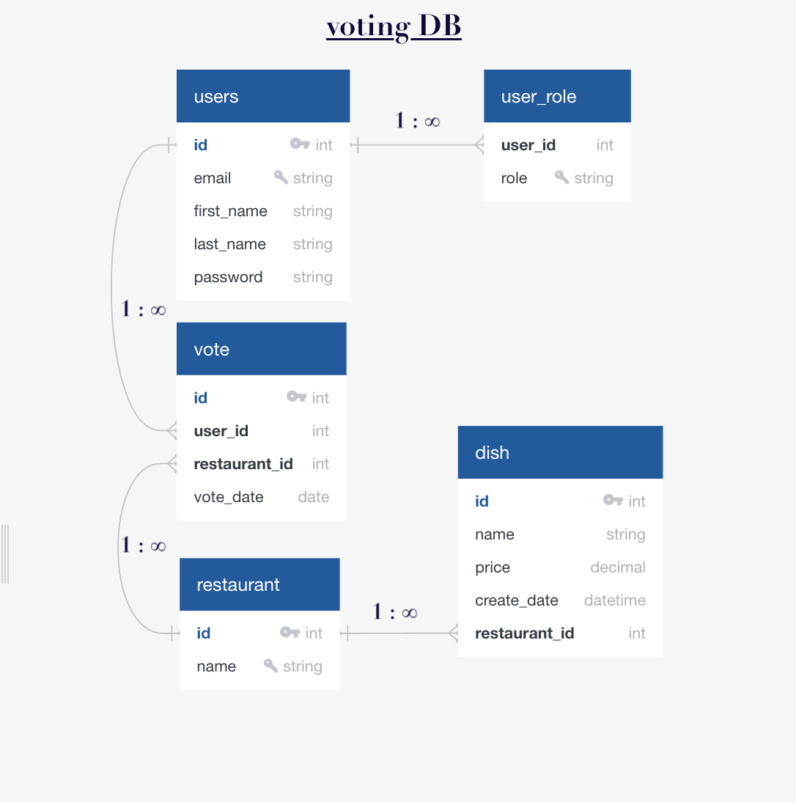

###Technical specification:
https://github.com/JavaWebinar/topjava/blob/doc/doc/graduation.md#technical-requirement

####Glossary:

- Restaurant: place added by admins that has a menu (list of dishes)

- Dish:  menu item at a restaurant with name and price

- Client: client who use my API: admin or user

- Vote: a unique choice of user for a specific restaurant

###API specification:
- http://localhost:8080/swagger-ui.html

####Endpoints to test the application:
Basic Auth for the user: `user@gmail.com / password`
Basic Auth for the admin: `admin@gmail.com / admin`
1) Add new restaurant if admin
- POST http://localhost:8080/api/admin/restaurants/new
- RequestBody without dishes: `{}`
- RequestBody with dish(es): `{    
  "dishes": [{
  "name": "dish5",
  "price": 10
  }]    
  }`
2) Update dish of the specified restaurant if admin
- localhost:8080/{user_id}/menu/{dish_id}/update
- RequestParams: user_id=2, dish_id=4
- RequestBody : `{    
  "name": "dish4",
  "price": 44
  }
3) Add new dish to the specified restaurant if admin
- localhost:8080/{user_id}/menu/add/{restaurant_id}/
- RequestParams: user_id=2, restaurant_id=2
- RequestBody : `{    
  "name": "newTea",
  "price": 15
  }`

4) Disable (not Remove for audit) the specified dish if admin
- localhost:8080/{user_id}/menu/{dish_id}/disable
- RequestParams: user_id=2, dish_id=3

`

####Access H2 console to view DB:
- http://localhost:8080/h2-console

####UML for VOTING DB:
https://app.quickdatabasediagrams.com/

 -- TODO

####Tech stack:
- Java 17
- Maven
- Spring Boot 3.0
- H2 DB
- Junit 5

####Notes:
- *ServiceImpl classes are omitted for simplicity
- Catalog=DB=VOTING, Schema=namespace=VOTES

### CURL commands to test HTTP requests

#### get All Users
`curl -s http://localhost:8080/topjava/rest/admin/users`

#### get Users 100001
`curl -s http://localhost:8080/topjava/rest/admin/users/100001`

#### get All Meals
`curl -s http://localhost:8080/topjava/rest/profile/meals`

#### get Meals 100003
`curl -s http://localhost:8080/topjava/rest/profile/meals/100003`

#### filter Meals
`curl -s "http://localhost:8080/topjava/rest/profile/meals/filter?startDate=2020-01-30&startTime=07:00:00&endDate=2020-01-31&endTime=11:00:00"`

#### get Meals not found
`curl -s -v http://localhost:8080/topjava/rest/profile/meals/100008`

#### delete Meals
`curl -s -X DELETE http://localhost:8080/topjava/rest/profile/meals/100002`

#### create Meals
`curl -s -X POST -d '{"dateTime":"2020-02-01T12:00","description":"Created lunch","calories":300}' -H 'Content-Type:application/json;charset=UTF-8' http://localhost:8080/topjava/rest/profile/meals`

#### update Meals
`curl -s -X PUT -d '{"dateTime":"2020-01-30T07:00", "description":"Updated breakfast", "calories":200}' -H 'Content-Type: application/json' http://localhost:8080/topjava/rest/profile/meals/100003`

в выпускных проектах используйте эквивалентный
curl -v --user user@yandex.ru:password http://localhost:8080/topjava/rest/profile/meals

